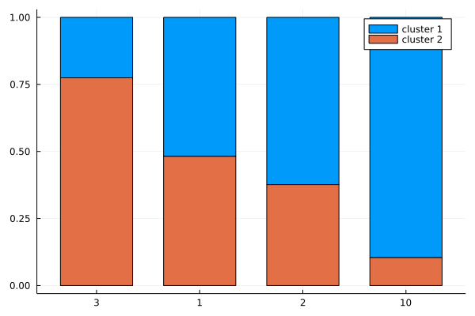

# LTN clustering demo

Implement the clustering demo as in [Logic Tensor Networks](https://arxiv.org/abs/2012.13635#)

It is a rather simple demo

The data set is a set of 4 points (in one dimension): [1,2,3,10]. We say [1,2,3] should be in one clustering and the [10] should be its own clustering.

The LTN approach to clustering is essentially a density-based clustering algorithm, though the objective is defined by a set of axioms and then made differentiable in real numbers.

points:

* use a simple dictionary as the predicate C, as it is a simple demo which does not need a NN.
* I have find a good way to imeplement a nicer forall and exists quantifier macro. And Zygote (AD in Julia) is not so good at list comprehension

